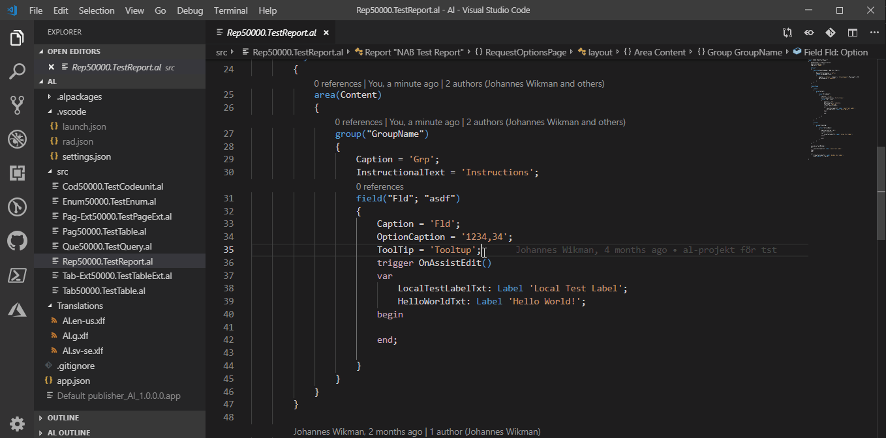
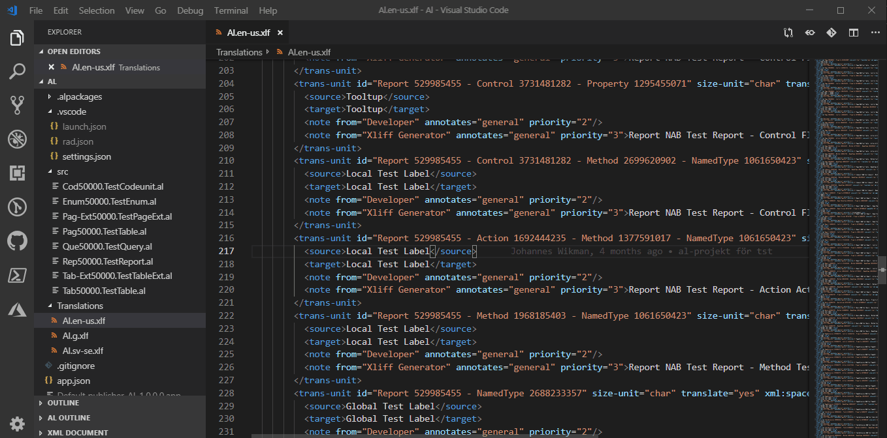

# NAB AL Tools

This extensions is a tool that helps with AL development.

## Table of Contents

[Features](#features)

* [XLIFF Tools](#xliff-tools)
  * NAB: Refresh XLF files from g.xlf
  * NAB: Find next untranslated text (Ctrl+Alt+U)
  * NAB: Find untranslated texts
  * NAB: Find translated texts of current line
  * NAB: Find code source of current line ("F12" in xlf files)
  * NAB: Sort XLF files as g.xlf
  * NAB: Sort XLF files as g.xlf
  * NAB: Copy \<source\> to \<target\>
* [Other Features](#other-features)
* [Snippets](#snippets)

[Requirements](#requirements)

[Extension Settings](#extension-settings)

[Known Issues](#known-issues)

[Release Notes](#release-notes)

[Contributing](#contributing)

## Features

### XLIFF Tools

The workflow for working with these XLIFF tools are

1. Write your code
1. Build your app, so that the g.xlf file gets updated
1. Execute "NAB: Refresh XLF files from g.xlf" from the Command Palette
1. Execute "NAB: Find next untranslated text" from the Command Palette and handle the untranslated/modified translation until you've handled them all

#### NAB: Refresh XLF files from g.xlf

Iterates the g.xlf file and updates all language xlf files. The default behavior is to insert the tags mentioned below. If the setting `NAB.UseExternalTranslationTool == true` the `state` attribute of `<target>` is modified instead.

* The xlf files gets the same ordering as g.xlf
* Translations marked as translate=no gets removed
* Modified translations get's prefixed with [NAB: REVIEW] or `<target state="needs-adaptation">`.
* New translations with the same source language as g.xlf gets copied to target, but prefixed with [NAB: REVIEW] or `<target state="needs-review-translation">`.
* New translations with other source language than g.xlf is replaced with [NAB: NOT TRANSLATED] or `<target state="new">`

_Please create an issue if you have an opinion of how the target states should be used or if you wish to see more functionality that improves the workflow when working with translation tools._

#### NAB: Find next untranslated text (Ctrl+Alt+U)

Finds the next occurance of the tags [NAB: NOT TRANSLATED] or [NAB: REVIEW] and selects the tag.

* If the tag [NAB: NOT TRANSLATED] is selected, replace it with the translated text
* If the tag [NAB: REVIEW] is selected, review the translation and update if needed, then you remove the tag

If the setting `NAB.UseExternalTranslationTool` is set to `true` it searches for any target with a state that is considered not completed. Which is any state except `final`, `signed-off`, `translated`. The [NAB:*]-tags are not used when this setting is activated.

#### NAB: Find untranslated texts

Uses the Find in Files feature to search for translation units in need of review or translation.
*Please read Known Issues below.*

#### NAB: Find translated texts of current line

Place the cursor on a AL code line that should be translated and execute this command to use the Find in Files feature to find all occurences of the translations.
*Please read Known Issues below.*

#### NAB: Find code source of current line ("F12" in xlf files)

Place the cursor somewhere in a trans-unit node in the xlf file and execute this command to navigate to the source code for that translation.

#### NAB: Sort XLF files as g.xlf

Updates all language xlf files with the same sorting as the g.xlf file

#### NAB: Copy \<source\> to \<target\>

Copies the content of the \<source\> element to the \<target\> element. Use this when positioned on a target line in a xlf file.

### Other Features

#### NAB: Uninstall dependendent apps

Uninstalls dependant apps through PowerShell. Useful if you cannot install your app due to dependencies.

Only works for local installations, not Docker, not Saas Sandbox.

#### NAB: Sign app file

Sign the app file (matching your current app.json). You must first have the Code Signing Certificate installed in the Current User Personal Store (Cert:\CurrentUser\My if you're importing with PowerShell).

#### NAB: Deploy and Run TestTool without Debugger

Useful if you're using a separate app as a test app

Requirements:

* Must be using a workspace
* The main app's workspace folder must be called "App"
* The test app's workspace folder must be called "TestApp"

When this command is  executed, VSCode...

* Updates the launch.json in both App and TestApp to only contain the first configuration (the original launch.json is copied to ".vscode\\launch_bak.json) to avoid the prompt
* Uninstalls all dependent apps (of your main app)
* Build and deploy Main App
* Build and deploy Test App
* Uses the first configuration in the launch.json of the TestApp to eventually launch the web client, without debugging. Tip: Configure this to run page 130401!
* Restores the original launch.json

#### NAB: Deploy and Run TestTool with Debugger

The same feature as above, but with debugging

### Snippets

#### Assign text variable with CopyStr

Since CodeCop rule AA0139 complains on possible overflow, we need to assign text variables with a CopyStr statement

#### Test Codeunit

Inserts a stub Test Codeunit

#### Test Function

Inserts a stub Test Function

#### Test SendNotificationHandler

Inserts a generic SendNotificationHandler function

#### Test MessageHandler

Inserts a generic MessageHandler function

#### Test ConfirmHandler

Inserts a generic ConfirmHandler function

#### Declare Dictionary

Define variable of type Dictionary

#### Declare List

Define variable of type List

#### Declare Enum value

Declare enum value with caption.

## Requirements

This extension requires the [Microsoft AL Language Extension](https://marketplace.visualstudio.com/items?itemName=ms-dynamics-smb.al "AL Language") to fully work.

## Extension Settings

This extension contributes the following settings:

* `NAB.SigningCertificateName`: The name of the certificate used to sing app files. The certificate needs to be installed to the Personal store. For instructions on how to install the pfx certificate in the Personal Store, go to [Microsoft Docs](https://docs.microsoft.com/en-us/windows-hardware/drivers/install/importing-an-spc-into-a-certificate-store).
* `NAB.SignToolPath`: The full path to signtool.exe, used for signing app files. If this is not set the extension tries to find it on the default locations, if the signtool.exe is not found it tries to download and install signtool.
* `NAB.UseExternalTranslationTool`: Modifies the state-attribute of the translation unit when running `NAB: Refresh XLF files from g.xlf` instead of inserting a searchable string. Useful when working with external translation software.
* `NAB.ReplaceSelfClosingXlfTags`: Replaces self closing tags like `<tag/>` with a separate closing tag `</tag>`. Activated by default.
* `NAB.SearchOnlyXlfFiles`: If enabled, the "NAB:Find Untranslated texts" function only searches *.xlf files. Be aware of that the *.xlf file filter remains in "Find in Files" after this command has been run. This should be enabled in large projects (as Base Application) for performance reasons.
* `NAB.MatchTranslation`: If enabled, the "NAB: Refresh XLF files from g.xlf" function tries to match sources in the translated xlf file to reuse translations. A found match of "source" is then prefixed with [NAB: REVIEW] for manual review. If several matches are found, all matches are added as targets and you need delete the ones you do not want. You can do this by using "Find next untranslated" (Ctrl+Alt+U). This feature only works if "UseExternalTranslationTool" is disabled. Activated by default.

## Known Issues

The Find in Files API was a bit [buggy](https://github.com/microsoft/vscode/issues/29405) before VSCode v1.34... I had to create a [PR for VSCode](https://github.com/microsoft/vscode/pull/71626) for this to work properly and in VSCode v1.34 this was finally released, yey! So be sure to update VSCode to v1.34 or later.

## Release Notes

### 0.3.x

Beta release.

Please read our contribution guidelines and submit issues on [GitHub](https://github.com/jwikman/nab-al-tools/issues)

## Contributing

You are always welcome to open an issue for enhancements and bugs. If you'd like to give it a swing yourself you can follow this little guide to get up and running: [How To Contribute](./CONTRIBUTING.md).

<!--
* [Visual Studio Code's Markdown Support](http://code.visualstudio.com/docs/languages/markdown)
* [Markdown Syntax Reference](https://help.github.com/articles/markdown-basics/)
-->
