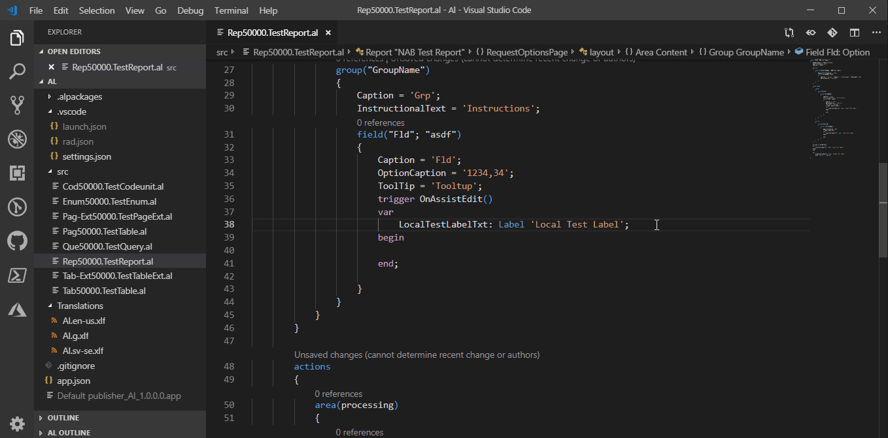
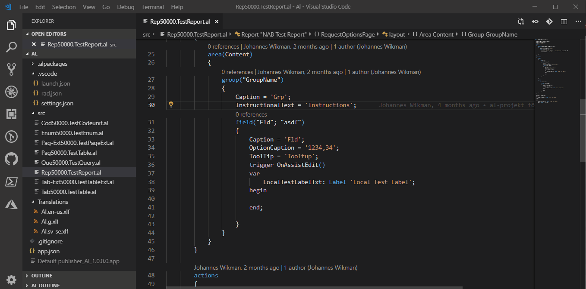
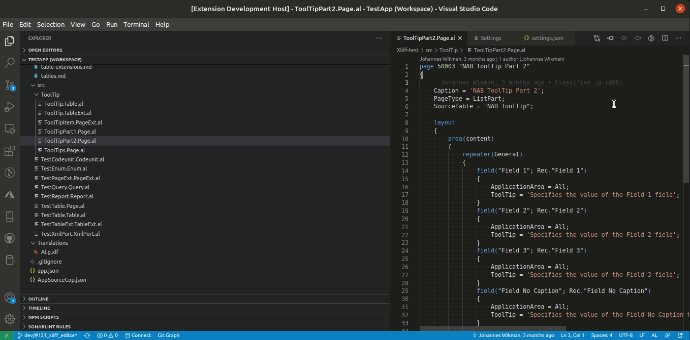
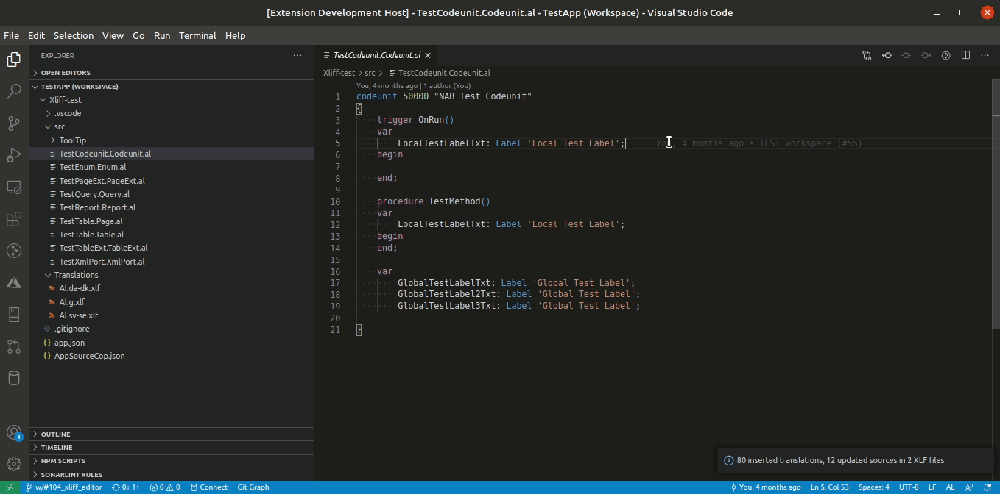

# NAB AL Tools

[](https://opensource.org/licenses/MIT)
[](https://marketplace.visualstudio.com/items?itemName=nabsolutions.nab-al-tools)
[](https://marketplace.visualstudio.com/items?itemName=nabsolutions.nab-al-tools)
[](https://github.com/jwikman/nab-al-tools/actions)

**NAB AL Tools** is a comprehensive development and translation management extension for AL language and Microsoft Dynamics 365 Business Central. This powerful toolkit streamlines your AL development workflow with advanced XLIFF translation management, automated documentation generation, AI-powered language model integration, and much more.

## NAB Solutions and SmartApps

NAB AL Tools is developed and maintained by the people at [NAB Solutions](https://nabsolutions.com/),
a Microsoft Dynamics 365 consulting and development firm, and [SmartApps](https://smartappsford365.com/),
an AppSource application provider. We've open-sourced this extension to contribute to the Business Central
development community and welcome external contributions that help improve and expand its capabilities.

## Key Highlights

🌐 **Professional Translation Management** - Complete XLIFF workflow with base app matching and state management  
📚 **Automated Documentation** - Generate external and tooltip documentation from your AL code  
🤖 **AI Language Model Integration** - Built-in tools for AI-assisted translation workflows  
⚡ **Productivity Features** - Code snippets, hover providers, keyboard shortcuts, and project templates  
🔧 **Development Tools** - Permission set generation, object renumbering, and debugging utilities

## Table of Contents

[Features](#features)

- [XLIFF Tools](#xliff-tools)
  - [NAB: Refresh XLF files from g.xlf](#nab-refresh-xlf-files-from-gxlf)
  - [NAB: Match translations from external XLF file](#nab-match-translations-from-external-xlf-file)
  - [NAB: Find next untranslated text (Ctrl+Alt+U)](#nab-find-next-untranslated-text-ctrlaltu)
  - [NAB: Find untranslated texts](#nab-find-untranslated-texts)
  - [NAB: Find multiple targets in XLF files](#nab-find-multiple-targets-in-xlf-files)
  - [NAB: Find translated texts of current line](#nab-find-translated-texts-of-current-line)
  - [NAB: Find source of current Translation Unit ("F12" in xlf files)](#nab-find-source-of-current-translation-unit-f12-in-xlf-files)
  - [NAB: Sort XLF files as g.xlf](#nab-sort-xlf-files-as-gxlf)
  - [NAB: Update g.xlf](#nab-update-gxlf)
  - [NAB: Update all XLF files](#nab-update-all-xlf-files)
  - [NAB: Copy \<source\> to \<target\>](#nab-copy-source-to-target)
  - [NAB: Copy all \<source\> to untranslated \<target\>](#nab-copy-all-source-to-untranslated-target)
  - [NAB: Download Base App Translation files](#nab-download-base-app-translation-files)
  - [NAB: Match Translations From Base Application](#nab-match-translations-from-base-application)
  - [NAB: Create translation XLF for new language](#nab-create-translation-xlf-for-new-language)
  - [NAB: Create XLF with selected Source Language](#nab-create-xlf-with-selected-source-language)
  - [NAB: Import Translations by Id](#nab-import-translations-by-id)
  - [Work with Dynamics 365 Translation Service (DTS)](#work-with-dynamics-365-translation-service-dts)
  - [Show translations on hover](#show-translations-on-hover)
- [Language Model Tools](#language-model-tools)
  - [nab-al-tools-refreshXlf](#nab-al-tools-refreshxlf)
  - [nab-al-tools-getTextsToTranslate](#nab-al-tools-gettextstotranslate)
  - [nab-al-tools-getTranslatedTextsMap](#nab-al-tools-gettranslatedtextsmap)
  - [nab-al-tools-getTranslatedTextsByState](#nab-al-tools-gettranslatedtextsbystate)
  - [nab-al-tools-saveTranslatedTexts](#nab-al-tools-savetranslatedtexts)
  - [nab-al-tools-getTextsByKeyword](#nab-al-tools-gettextsbykeyword)
  - [nab-al-tools-getGlossaryTerms](#nab-al-tools-getglossaryterms)
- [MCP Server](#mcp-server)
- [Documentation](#documentation)
  - [NAB: Generate External Documentation](#nab-generate-external-documentation)
  - [NAB: Generate ToolTip Documentation](#nab-generate-tooltip-documentation)
- [Command Line Interface](#command-line-interface)
- [Other Features](#other-features)
  - [NAB: Edit Xliff Document](#nab-edit-xliff-document)
  - [NAB: Export Translations to .csv](#nab-export-translations-to-csv)
  - [NAB: Export Translations to .csv (Select columns and filter)](#nab-export-translations-to-csv-select-columns-and-filter)
  - [NAB: Create PermissionSet for all objects](#nab-create-permissionset-for-all-objects)
  - [NAB: Import Translations from .csv](#nab-import-translations-from-csv)
  - [NAB: Convert to PermissionSet object](#nab-convert-to-permissionset-object)
  - [NAB: Renumber AL objects](#nab-renumber-al-objects)
  - [NAB: Create AL Project from Template](#nab-create-al-project-from-template)
  - [NAB: Report Issue](#nab-report-issue)
- [Snippets](#snippets)

[Requirements](#requirements)

[Extension Settings](#extension-settings)

[Contributing](#contributing)

[Limitations](#limitations)

## Features

### XLIFF Tools

The workflow for working with these XLIFF tools are

1. Write your code
1. Build your app, so that the g.xlf file gets updated
1. Execute "NAB: Refresh XLF files from g.xlf" from the Command Palette
1. Execute "NAB: Find next untranslated text" from the Command Palette and handle the untranslated/modified translation until you've handled them all



#### NAB: Refresh XLF files from g.xlf

Iterates the g.xlf file and updates all language xlf files. The default behavior is to insert the tags mentioned below. If the setting `NAB.UseExternalTranslationTool == true` the `state` attribute of `<target>` is modified instead.

- The xlf files gets the same ordering as g.xlf
- Translations marked as translate=no gets removed
- Modified translations gets prefixed with `[NAB: REVIEW]` or `<target state="needs-adaptation">`.
- New translations with the same source language as g.xlf gets copied to target, but prefixed with `[NAB: REVIEW]` or `<target state="needs-review-translation">`.
- New translations with other source language than g.xlf is replaced with `[NAB: NOT TRANSLATED]` or `<target state="new">`
- If the setting `NAB.MatchTranslation` is enabled and a not translated text is found, it tries to match the source texts to find if this text has been translated before. Read more in the `NAB.MatchTranslation` setting.
- If a translation tag (`[NAB: NOT TRANSLATED]`, `[NAB: REVIEW]` and `[NAB: SUGGESTION]`) is added, there is also an added note that explains why this is done. The note can be identified by the "from" attribute that is set to "NAB AL Tools". If this note exists when the `NAB: Refresh XLF files from g.xlf` is executed again and the translation tag is removed, this note will be removed.
  - If the setting `NAB.UseExternalTranslationTool` is enabled this note is added as well. The note is then removed when the target state attribute is set to "translated".

_Please create an issue if you have an opinion of how the target states should be used or if you wish to see more functionality that improves the workflow when working with translation tools._


#### NAB: Match translations from external XLF file

Works similar as `NAB: Refresh XLF files from g.xlf`, but you will first need to select another xlf file to use for matching (read more about matching in the `NAB.MatchTranslation` setting documentation).

- Only xlf files with the same target language as the selected xlf file will be modified.

#### NAB: Find next untranslated text (Ctrl+Alt+U)

Quickly navigates to the next translation that needs attention. This feature helps you efficiently work through all translations that require review or completion.

When `NAB.UseExternalTranslationTool` is set to `false` (default):

- The command searches for and selects the next occurrence of `[NAB: NOT TRANSLATED]`, `[NAB: REVIEW]`, or `[NAB: SUGGESTION]` tags
- For `[NAB: NOT TRANSLATED]` tags: Replace the tag with your translation
- For `[NAB: REVIEW]` tags: Review and update the translation as needed, then remove the tag
- For `[NAB: SUGGESTION]` tags: Review the suggested translation (added by source matching), update if needed, then remove the tag

When `NAB.UseExternalTranslationTool` is set to `true`:

- The command searches for any target with a state that requires attention
- This includes any state except `final`, `signed-off`, or `translated`
- The `[NAB:*]` tags aren't used in this mode as state attributes control the workflow instead

Use this command repeatedly to efficiently process all translations that need attention.

#### NAB: Find untranslated texts

Uses the Find in Files feature to search for translation units in need of review or translation.

#### NAB: Find multiple targets in XLF files

Use this command to find all places where you've got multiple targets, caused by the matching finding multiple sources with different translations

#### NAB: Find translated texts of current line

Place the cursor on a AL code line that should be translated and execute this command to find any translations of the selected line. If there are only one translation file, the translation file will be opened with the translation selected. If there are more than one translation file (or if the translation could not be found in the only translation file), the Find in Files feature will be used to find all occurrences of the translations.



#### NAB: Find source of current Translation Unit ("F12" in xlf files)

Place the cursor somewhere in a trans-unit node in the xlf file and execute this command to navigate to the source code for that translation.


#### NAB: Sort XLF files as g.xlf

Updates all language xlf files with the same sorting as the g.xlf file

#### NAB: Copy \<source\> to \<target\>

Copies the content of the \<source\> element to the \<target\> element. Use this when positioned on a target line in an xlf file.

#### NAB: Copy all \<source\> to untranslated \<target\>

Copies the content of the \<source\> element to the \<target\> element for all translation units that is untranslated. All copied targets are optionally marked for review. This might be useful if your code that was converted from C/AL contained only translated texts, with no ENU (en-US) translation. After this has been done, all texts in source code can be changed to english over time.

#### NAB: Update g.xlf

Updates the g.xlf file from AL files. Practical if you need to update translations when you don't have all symbols to compile the solution.
All new trans-units will be placed in the bottom of the g.xlf file. When a build is done later, the g.xlf will be sorted in the correct way. Use the functions `NAB: Sort XLF files as g.xlf` or `NAB: Refresh XLF files from g.xlf` to sort the translated files in the same way as g.xlf.
The only case where this function will remove an existing trans-unit from the g.xlf file is if a text has been changed to Locked = true.

Note: This function relies completely on text matching (hence no need for symbols). This has a couple of consequences:

- Make sure that the code is correctly formatted. Use the auto format functionality from the AL Language extension for this.
- There are probably cases that we just don't support yet. If you find one, please report an issue at [GitHub](https://github.com/jwikman/nab-al-tools/issues) with as much info as possible for us to reproduce the issue (the AL file, the g.xlf file etc.)

#### NAB: Update all XLF files

Runs the feature [NAB: Update g.xlf](#nab-update-gxlf) followed by [NAB: Refresh XLF files from g.xlf](#nab-refresh-xlf-files-from-gxlf).

#### NAB: Download Base App Translation files

Downloads Base App translations matching the target-language of the XLF files in the current workspace. The files downloaded consists of json files with a size of 5-10mb. The files are downloaded to the VS Code extension folder and should not be visible or otherwise affect your workspace. _This feature is a preview and will likely be removed in the future to be handled in the background where needed_.

#### NAB: Match Translations From Base Application

Downloads and uses Base App translations matching the target langugage of translation files. Provides suggestions prefixed with `[NAB: SUGGESTION]` on untranslated trans-units where the source string is found in Base App.

Intended workflow:

- `NAB: Refresh XLF files from g.xlf (*optional*)`
- `NAB: Match Translations From Base Application`

#### NAB: Create translation XLF for new language

Creates and opens a new translation file for selected target language with the option to match translations from BaseApp to get you going. The new translation file is saved as `<app-name>.<language-code>.xlf` in workspace translation folder. Note that there is no validation of the new target language code.


#### NAB: Create XLF with selected Source Language

Creates a new XLF file using translations from one language as the source and another as the target language. This feature is particularly useful when you need to translate between two non-English languages.

**Workflow:**

1. Select a source language XLF file (must contain completed translations)
2. Select a target language XLF file
3. A new XLF file is created with the source language texts as sources and target language entries as targets

Only translation units that are properly translated (not in need of review) in the source file are included. The target states from the target file are preserved in the new file.

After performing translations on this new file, use `NAB: Import Translations by Id` to update the original target language file with your translations.

This function respects the `NAB.SkipTranslationPropertyForLanguage` setting.

#### NAB: Import Translations by Id

Updates an XLF file with translations from another XLF file, matching translation units by their `id` attribute.

**Workflow:**

1. Select the source XLF file containing the translations to import
2. Select the target XLF file to update
3. Translation units are updated if:
   - The `id` exists in both files
   - The target text differs between the files

This command is designed to work with files created by `NAB: Create XLF with selected Source Language`, allowing you to bring translations from an intermediate file back into your main translation files.

#### Work with Dynamics 365 Translation Service (DTS)

> **⚠️ DEPRECATION NOTICE**: Microsoft Dynamics 365 Translation Service (DTS) has been deprecated and will reach end-of-support in October 2025. See [Microsoft's official announcement](https://learn.microsoft.com/en-us/dynamics365/fin-ops-core/fin-ops/get-started/removed-deprecated-features-platform-updates) for more details.
>
> **NAB AL Tools DTS features are now deprecated** and will be removed in a future version. We recommend migrating to alternative translation workflows using the other XLIFF tools provided by this extension.

To make the work with Dynamics 365 Translation Service (DTS) a bit easier, a few things are added. (More details can be found in [issue 149](https://github.com/jwikman/nab-al-tools/issues/149))

When you want to start to work with DTS there are two things you need to do in your workspace to prepare the XLF files before you use DTS for the first time:

1. Activate the setting `NAB.UseDTS`
1. Add your DTS Project ID (found in the URL on DTS when you've selected a project) to the `NAB.DTS ProjectId` setting.
1. Execute the function `NAB: Format current XLF file for DTS` to format the XLF files in the same way as DTS seems to do.

Use the function [NAB: Create translation XLF for new language](#nab-create-translation-xlf-for-new-language) if you want to add a new language.

After that, every time you want to translate anything with DTS, the translation flow would be something like:

1. Build your app to update the g.xlf file
1. Execute `NAB: Open DTS (Dynamics 365 Translation Service)` to create zip files for the xlf files in a folder called ".dts" and open DTS.
1. Upload the g.zip file on DTS
1. Upload the language xlf file (xx-YY.zip file), that was formatted as DTS above. Repeat this step for every language.
1. Let DTS do the translation
1. Download the zip file(s) with the translated xlf file(s) and save in the ".dts" folder.
1. Execute `NAB: Import DTS Translations` and select the output.zip files that should be imported. The xlf files in the translation folder with the same target-language that's in the selected zip files will be updated.
1. Go through all trans-units with a target-state that needs review. This extension supports at least two ways of doing this:
   1. Use the Xliff Editor
      1. Open the xlf file and execute `NAB: Edit Xliff Document` to open the editor.
      1. Filter on all trans-units in need of review.
      1. Review every line, modify target text if needed.
      1. Tick the "Translated" box when the translation is completed.
      1. Repeat until done.
   1. Go through the xlf file manually:
      1. Find the first trans-unit with a review need (Use Ctrl+Alt+U to quickly navigate there)
      1. Review the translation
      1. Use the function `NAB: Set Translation Unit to "translated"` (Ctrl+Alt+Q) to set the target state to "translated" or Use the function `NAB: Set Translation Unit to "signed-off"` (Ctrl+Alt+S) to set the target state to "signed-off"
      1. Now you'll be navigated to the next trans-unit that needs review.
      1. Repeat until done.

This can also be combined with the features [NAB: Export Translations to .csv](#nab-export-translations-to-csv) and [NAB: Import Translations from .csv](#nab-import-translations-from-csv), if someone without access to the repository needs to work with the translations.

##### DTS Substitution Dictionary

When running `NAB: Import DTS Translations` the targets are matched against words in a dictionary. The dictionary is intended to substitute words that are continuously translated to a word not quite fitting to the context.

- The dictionary is created and stored in the `Translations` folder of your AL project.
- The dictionary is a JSON file, one file per target language is created with the naming convention: `<language-code>.dts.json`.
- Dictionary files are automatically created when importing DTS translations.
  - Words are not automatically added to the word list. This is a manual process.
  - Required properties are `word` and `replacement`.
  - The `settings` property is not required. Missing settings will be assigned a default values during runtime. See example below.
- Use of the dictionary can be toggled with the setting `useDictionaryInDTSImport` (default `true`).

###### Example of a dictionary

```json
{
    "language": "sv-SE",
    "wordList": [
        {
            "word": "Kontrakt",
            "replacement": "Avtal",
            "settings": {
                // Toggles word boundary search. Default: true
                "matchWholeWord": true,
                // Toggles case sensitivity. Default: true
                "matchCasing": true,
                // Toggles case preservation of first characted. Default: true
                "keepCasingOnFirstCharacter": true
            }
        }

```

#### Show translations on hover

To make it easier to see the different translations of a translated text in the AL Code, as captions, labels etc, you can hover over the text to get a list of the different translations. Each translation links to the translation inside the XLF file. The setting `NAB.EnableTranslationsOnHover` enables and disables this feature. It is enabled by default.

It is recommended to disable this feature on workspaces with very large XLF files, since it can slow down the system significantly.

### Language Model Tools

NAB AL Tools provides several Language Model Tools that can be used with GitHub Copilot Chat or other AI assistants that support VS Code Language Model Tools. These tools are designed to enhance translation workflows by enabling AI assistants to interact with XLF files.

> **Note:** These Language Model Tools are currently in preview and their functionality or API may change in future releases.

These Language Model Tools make it possible to create AI-assisted translation workflows, where an AI assistant can help identify untranslated text, suggest translations based on existing translations, and update XLF files accordingly.

#### nab-al-tools-refreshXlf

Refreshes a XLF language file using a generated XLF file (g.xlf). This tool performs similar functions to the "NAB: Refresh XLF files from g.xlf" command but can be directly invoked by AI assistants.

- Preserves existing translations while adding new translation units
- Maintains the state of translated units
- Sorts the file according to the g.xlf structure

#### nab-al-tools-getTextsToTranslate

Retrieves untranslated texts from a specified XLF file. This tool helps identify which texts need translation by returning:

- Unique identifier for each translation unit
- Source text to be translated
- Source language
- Maximum character limit (if applicable)
- Contextual comments (explaining placeholders like %1, %2, %3)

#### nab-al-tools-getTranslatedTextsMap

Retrieves previously translated texts from a specified XLF file. This tool helps maintain translation consistency by:

- Providing access to existing translations
- Allowing reference to previously translated terminology and phrases
- Supporting translation between similar languages via an optional source language file

#### nab-al-tools-getTranslatedTextsByState

Retrieves translations filtered by state from a specified XLF file. This tool allows you to query translations based on their state (such as 'needs-review', 'translated', 'final', or 'signed-off') by returning:

- Unique identifier for each translation unit
- Source text and its translated target
- Current translation state
- Review reason (if available, explaining why a translation needs review)
- Maximum character limit (if applicable)
- Contextual comments (explaining placeholders like %1, %2, %3)

This tool is particularly useful for focusing on translations in specific states during the review process or when generating reports.

#### nab-al-tools-saveTranslatedTexts

Writes translated texts to a specified XLF file. This tool enables efficient updating of XLF files with:

- Support for batch translation updates
- Preservation of the XLIFF format integrity
- Targeted updates to only specified translation units
- Ability to set translation states ('needs-review-translation', 'translated', 'final', 'signed-off')

#### nab-al-tools-getTextsByKeyword

Searches source texts in an XLF file for a given keyword or regular expression and returns matching translation units.

- Searches only the `<source>` element; includes untranslated units as well
- Useful for terminology reviews, ensuring consistency, and locating related units
- Supports case sensitivity toggle and regex-based searches
- Supports pagination with offset/limit (limit 0 returns all matches)

Returned fields include id, source text, target text (if available), source language, translation state (if available), review reason, type/context, max length (if applicable), and comment.

#### nab-al-tools-getGlossaryTerms

Returns glossary terminology pairs from a built-in Business Central glossary for a target language (with optional source language, default en-US).

- Use before/during translation to enforce consistent terminology
- Helpful for automated suggestion validation and QA review workflows
- Returns an array of entries with source term, target term, and description (when available)

Create an issue on https://github.com/jwikman/nab-al-tools/issues if you have suggestions for additional glossary terms.

### MCP Server

NAB AL Tools also provides an MCP (Model Context Protocol) server that exposes the same set of tools listed under Language Model Tools. This lets MCP-compatible clients use the translation workflow tools outside of VS Code chat integrations.

- The MCP server offers the same endpoints as above (refreshXlf, getTextsToTranslate, getTranslatedTextsMap, getTranslatedTextsByState, saveTranslatedTexts, getTextsByKeyword, getGlossaryTerms)
- To view server status, configuration, and usage details in VS Code, run: “NAB: Show MCP Server Information”
- For the complete MCP tool reference and payload schemas, see MCP_SERVER.md

### Documentation

#### NAB: Generate External Documentation

Generates documentation that is intended to be used as an external documentation. I.e. to be read by someone that wants to extend the app by API, Web Services or with an extension. The documentation is created as [markdown](https://en.wikipedia.org/wiki/Markdown) files. The markdown files could be transformed to html files with the help of [DocFx](https://dotnet.github.io/docfx/) or other tools.

The content is generated from the AL code and the [XML Comments](https://docs.microsoft.com/dynamics365/business-central/dev-itpro/developer/devenv-xml-comments) that are written in the AL code.

The following XML Comments are currently supported

- `<summary>`
- `<param>`
- `<returns>`
- `<remarks>`
- `<example>`

The following formatting tags are currently supported

- `<para>`
- `<b>`
- `<i>`
- `<c>`
- `<code>`

The first line in the summary tag for object, fields, actions, parts, procedure or event are used for all objects, procedures or events overview pages in the documentation.

There are three types of files that are created with their own index page. The different index files will only be created if there are any objects of that type.

- "Public Objects" - Objects that has either public procedures or public events. Can be Codeunits, Tables, Table Extensions, Pages, Page Extensions, Enums or Interfaces.
- "API" - API Pages and API Queries
- "Web Services" - Pages or Codeunits that are published as Web Services through a webservices.xml file

Several settings exists for customizing the documentation:

- `NAB.TooltipDocsFilePath` - When creating ToolTip documentation, this setting specifies the path and filename of the md file that should be used. Both absolute and relative (to the current workspace folder) can be used.
- `NAB.GenerateTooltipDocsWithExternalDocs` - When creating external documentation, this setting specifies if the ToolTip file should be created as well.
- `NAB.DocsRootPath` - When creating external documentation, this setting specifies where all md files will be created. Both absolute and relative (to the current workspace folder) can be used.
- `NAB.CreateTocFilesForDocs` - When creating external documentation, this setting specifies if TOC (table of contents) files should be created.
- `NAB.documentation.output.indexFile` - When creating external documentation, this setting specifies if an index.md file should be created with links to other pages. The setting `NAB.CreateTocFilesForDocs` must be enabled for this to work.
- `NAB.documentation.output.indexFilePath` - When creating the index file, this setting specifies the name and path of the index file. By default the file will be named index.md and placed in the root of the Docs folder (specified by the NAB.DocsRootPath setting). The path must be relative to the Docs folder and must include the filename.
- `NAB.documentation.output.indexFileDepth` - When creating the index file for external documentation, this setting specifies the number of levels for the links.
- `NAB.documentation.api.IncludeDataType`: When creating external documentation, this setting specifies if the data types of fields on API pages should be included. The Data Type will only be available if the field source is a table field or a global variable.
- `NAB.documentation.yamlTitle.enabled`: When creating external documentation, this setting specifies if a title should be created in a Yaml Header in each generated md file.
- `NAB.documentation.yamlTitle.prefix`: When creating external documentation, this setting specifies a prefix to the YAML title created in the Yaml Header in each generated md file. This settings is only used if the `NAB.documentation.yamlTitle.enabled` setting is enabled. The special containers `{appName}`, `{publisher}` and `{version}` can be used in this setting, they will be replaced by the values from app.json when the title is created.
- `NAB.documentation.yamlTitle.suffix`: When creating external documentation, this setting specifies a suffix to the YAML title created in the Yaml Header in each generated md file. This settings is only used if the `NAB.documentation.yamlTitle.enabled` setting is enabled. The special containers `{appName}`, `{publisher}` and `{version}` can be used in this setting, they will be replaced by the values from app.json when the title is created.
- `NAB.RemoveObjectNamePrefixFromDocs` - When creating external documentation, this setting will remove the specified prefix from the md files. I.e. if your objects are prefixed with \"ABC \", you set this setting to \"ABC\" and that will be removed from the object names in the md files.
- `NAB.DocsIgnorePaths` - When documentation are created from al files, the files that matches the patterns specified in this setting will be ignored. The paths should use glob pattern.
- `NAB.GenerateDeprecatedFeaturesPageWithExternalDocs` - When creating external documentation, this setting specifies if a page with public obsoleted objects/procedures/controls should be created.
- `NAB.CreateInfoFileForDocs` - When creating external documentation, this setting specifies if an info.json file should be created. This file will contain version info, creation date etc.
- `NAB.documentation.includeAllProcedures` - When creating external documentation, this setting specifies if all procedures should be included. If not enabled, only public procedures will be included.
- `NAB.IncludeTablesAndFieldsInDocs` - When creating external documentation, this setting specifies if all tables and fields should be included. If not enabled, only tables with public (or any, if `NAB.documentation.includeAllProcedures` is enabled) procedures will be included.
- `NAB.documentation.includeReports` - When creating external documentation, this setting specifies if Reports should be included. If not enabled, only Reports with public (or any, if `NAB.documentation.includeAllProcedures` is enabled) procedures will be included.
- `NAB.documentation.includeXmlPorts` - When creating external documentation, this setting specifies if XmlPorts should be included. If not enabled, only XmlPorts with public (or any, if `NAB.documentation.includeAllProcedures` is enabled) procedures will be included.
- `NAB.documentation.includeQueries` - When creating external documentation, this setting specifies if Queries should be included. If not enabled, only Queries with public (or any, if `NAB.documentation.includeAllProcedures` is enabled) procedures will be included.
- `NAB.CreateUidForDocs` - When creating external documentation, this setting specifies if an UID should be created in a Yaml Header in each generated md file. The UID can then be used for linking in DocFx.

#### NAB: Generate ToolTip Documentation

Generates a MarkDown (.md) file with the ToolTips for all Pages and Page Extensions. All fields and action are listed per object. Empty or missing ToolTips will be included.

Fields and Actions with captions will be included in the documentation. If there are no Caption on the Page Field, the function tries to retrieve the Caption from the Source Table. This only works for tables inside the workspace.

The following naming standard in the object descriptor of Page Extensions is required to retrieve the captions from the Table Extension if there are no explicit Caption on the page field:

Pattern: `pageextension [Object ID] "[Object Name]" extends "[Base Page]" // [Base Page Object Id] ([Base Table Object Id])`

Example: `pageextension 50000 "My Item Card" extends "Item Card" // 30 (27)`

The following PageTypes are ignored:

- API
- ConfirmationDialog
- HeadlinePart
- NavigatePage
- ReportPreview
- ReportProcessingOnly
- RoleCenter
- StandardDialog
- XmlPort

Two settings can be used to ignore specific Pages or Page Extensions:

- NAB.TooltipDocsIgnorePageExtensionIds
- NAB.TooltipDocsIgnorePageIds

#### Formatting of XML Comments

A few functions is added to help with formatting of XML Comments.

- `NAB: XML Comment - Format bold`
- `NAB: XML Comment - Format italic`
- `NAB: XML Comment - Format inline code`
- `NAB: XML Comment - Format code block`

### Command Line Interface

Some functions in this extension can be invoked from the command line with [Node.js](https://nodejs.org/).
This can for example be useful when you want to invoke a function from a pipeline.

#### Prerequisites

Download and install [Node.js](https://nodejs.org/en/). (Tested on v14.16)

Download the latest version of NAB AL Tools manually from GitHub or VSCode Marketplace and unzip to a temporary folder, or use [Get-LatestNABALTools.ps1](https://github.com/jwikman/nab-al-tools/blob/main/dev-tools/PowerShell/Get-LatestNABALTools.ps1) to automatically download and unzip.

#### CreateDocumentation.js

This function invokes the [NAB: Generate External Documentation](#nab-generate-external-documentation) function from the command line.

##### CreateDocumentation.js Usage

```nodejs
node .\extension\dist\cli\CreateDocumentation.js <path-to-al-app-folder> <path-to-output-folder> [<path-to-workspace.code-workspace>] [<path-to-tooltip-file>]
```

- \<path-to-al-app-folder> - The path to the folder where the app.json is located
- \<path-to-output-folder> - The path to the folder where the documentation should be created
- \[\<path-to-workspace.code-workspace>] - The path to the .code-workspace file that is used for the app. This parameter is optional.
- \[\<path-to-tooltip-file>] - The path to the tooltip md file that should be updated. This parameter is optional.

All settings for the NAB AL Tool is read from the .code-workspace file if it is provided.
If there are any settings in \<path-to-al-app-folder>\\.vscode\settings.json, they will overwrite any settings from the .code-workspace file.

##### CreateDocumentation.js Example

Execute this function on the app with the Workspace-file "C:\git\MyAppWorkspace\MyApp.code-workspace", the source for the app in "C:\git\MyAppWorkspace\App" (the folder containing the app.json file) and the documentation files should be created in the folder "C:\Docs\MyApp\reference". The tooltip file that should be updates is called "C:\Docs\MyApp\tooltips.md":

```nodejs
node .\extension\dist\cli\CreateDocumentation.js "C:\git\MyAppWorkspace\App" "C:\Docs\MyApp\reference" "C:\git\MyAppWorkspace\MyApp.code-workspace" "C:\Docs\MyApp\tooltips.md"

```

#### RefreshXLF.js

This function invokes [NAB: Refresh XLF files from g.xlf](#nab-refresh-xlf-files-from-gxlf) and optionally [NAB: Update g.xlf](#nab-update-gxlf) from command line.

##### RefreshXLF.js Usage

```nodejs
node .\extension\dist\cli\RefreshXLF.js <path-to-al-app-folder> [--update-g-xlf] [--fail-changed]
```

- \<path-to-al-app-folder> - The path to the folder where the app.json is located
- --update-g-xlf - Updates g.xlf from .al files before refreshing target files ([NAB: Update g.xlf](#nab-update-gxlf)).
- --fail-changed - Fails job if any changes are found (exit code 1).

##### RefreshXLF.js Example

The following command first updates g.xlf from AL files and then refreshes localization files. If any changes are detected the job will fail.

```nodejs
node .\extension\dist\cli\RefreshXLF.js "C:\\git\\MyAppWorkspace\\App" --fail-changed --update-g-xlf
```

### Other Features

#### NAB: Suggest ToolTips

Inserts a ToolTip stub on page fields and actions. The stub will be commented out and needs to be reviewed, updated and un-commented manually.

This function only works when you're in a file that has a Page och Page extension object.

The suggestion will copy ToolTips from any page with the same SourceTable by matching the control type, name and value.

- If it's a field we're matching with fields with the same name and value
- If it's an action we're matching with actions with the same name.

No ToolTips will be added on fields on NavigatePages or API pages

#### NAB: Show next suggested ToolTip

Shows the next ToolTip stub in the current Page or PageExtension. Default shortcut Ctrl+Alt+P

#### NAB: Uninstall dependent apps

Uninstalls dependent apps through PowerShell. Useful if you cannot install your app due to dependencies.

Only works for local installations, not Docker, not SaaS Sandbox.

#### NAB: Sign app file

Sign the app file (matching your current app.json). You must first have the Code Signing Certificate installed in the Current User Personal Store (Cert:\CurrentUser\My if you're importing with PowerShell).

#### NAB: Deploy and Run TestTool without Debugger

Useful if you're using a separate app as a test app

Requirements:

- Must be using a workspace
- The main app's workspace folder must be called "App"
- The test app's workspace folder must be called "TestApp"

When this command is executed, VSCode...

- Updates the launch.json in both App and TestApp to only contain the first configuration (the original launch.json is copied to ".vscode\\launch_bak.json) to avoid the prompt
- Uninstalls all dependent apps (of your main app)
- Build and deploy Main App
- Build and deploy Test App
- Uses the first configuration in the launch.json of the TestApp to eventually launch the web client, without debugging. Tip: Configure this to run page 130401!
- Restores the original launch.json

#### NAB: Deploy and Run TestTool with Debugger

The same feature as above, but with debugging

#### NAB: Edit Xliff Document

Opens XLF-files for editing in a webview.

With the goal of reducing the clutter of XML files this feature is built for translators or non-developers in mind. Command available from right clicking a XLF-file and command palette.

Keyboard navigation:

- `Arrow Up` / `Arrow down` moves focus between lines.
- `F8` copies the target text from the line above.
- `TAB` focus is moved between the target textarea and the complete checkbox and then the next line.
- `Space` can be used to toggle the complete checkbox when it's in focus.



### NAB: Export Translations to .csv

Exports translation units (`trans-unit` elements) from a selected XLF file as tab separated values.

**Steps:**

1. Run `NAB: Export Translations from .csv` from command palette.
2. Select which XLF files to export, one or more needs to be selected.
3. File is exported.

**Remarks:**

- Export path:
  - If a path is set for setting `NAB.XliffCSVExportPath` that path is used. Otherwise it defaults to the Translation folder.
- Exported file name: `[App Name].[Language].csv`
- Separator: `\t` (TAB)
- EOL: `\r\n` (CRLF)

**Column order**:

1. Trans unit Id \*
2. Source \*
3. Target \*
4. Developer Note
5. Max Length
6. Comment (this will be empty, used for commenting changes in Excel later on)
7. Xliff Generator Note
8. NAB AL Tool Note
9. State
10. State Qualifier

\* required column.

#### Example

```xml
<xliff>
<file datatype="xml" source-language="en-US" target-language="sv-SE" original="AlTestApp">
    <body>
      <group id="body">
        <trans-unit id="Table 2328808854 - NamedType 12557645" size-unit="char" maxwidth="50" translate="yes" xml:space="preserve">
          <source>This is a test</source>
          <target state="final" state-qualifier="exact-match">Detta är ett test</target>
          <note from="Developer" annotates="general" priority="2">Some kind of Dev note</note>
          <note from="Xliff Generator" annotates="general" priority="3">Table MyTable - NamedType TestErr</note>
          <note from="NAB AL Tool Refresh Xlf" annotates="general" priority="3">Source has been modified.</note>
        </trans-unit>
        <trans-unit id="Page 2931038265 - NamedType 12557645" size-unit="char" translate="yes" xml:space="preserve">
          <source>Cool</source>
          <target>Sval</target>
          <note from="Developer" annotates="general" priority="2"/>
          <note from="Xliff Generator" annotates="general" priority="3">Page MyPage - NamedType TestErr</note>
        </trans-unit>
      </group>
    </body>
  </file>
</xliff>
```

is exported to

```csv
Id    Source    Target    Developer    Max Length    Comment    Xliff Generator Note    NAB AL Tool Refresh Xlf    State    State Qualifier
Table 2328808854 - NamedType 12557645    This is a test    Detta är ett test    Some kind of Dev note    50        Table MyTable - NamedType TestErr    Source has been modified.    final    exact-match
Page 2931038265 - NamedType 12557645    Cool    Sval                Page MyPage - NamedType TestErr
```

### NAB: Export Translations to .csv (Select columns and filter)

The same feature as [NAB: Export Translations to .csv](#nab-export-translations-to-csv) but you choose the columns to include in the exported file. `Id`, `Source` and `Target` are always exported and thus not selectable in the quick pick. A filter option of `All` and `In need of review` is also available.

### NAB: Import Translations from .csv

Imports and updates targets in translation units (`trans-unit` elements) of selected XLF file from a .csv file.

If the the app is configured to use an external translation tool (i.e. working with Target State attribute): Use the setting `NAB.Xliff CSV Import Target State` to configure how Target State should be handled during import. There are basically three type of options: Leave the State as-is, update the State from the .csv file or set the State to a configured value for all modified targets.

**Requirements of the .csv file:**

1. Column order must match the exported column order of `NAB: Export Translations to .csv`.
1. The columns in the .csv file must be separated by tabs.
1. The values in the `Id` and `Source` columns must not be modified from the exported values.

**Steps:**

1. Run `NAB: Import Translations from .csv` from command palette.
2. Select which XLF file to update.
3. Select .csv file to import.
4. File is imported, any changed target values are updated and the number of updated translation units is shown in an information box.

### NAB: Create PermissionSet for all objects

Creates a new AL file with a PermissionSet object. This PermissionSet object
includes all objects in the current workspace folder. All objects are added with
the "X" permissions. All tables are also added as TableData with "RIMD" permissions.

### NAB: Convert to PermissionSet object

Converts a PermissionSet defined in XML into a PermissionSet object.

- The user is prompted to supply a prefix that will be used for the object names. The default value is fetched from the first `mandatoryAffixes` in the AppSourceCop.json, if available.
- The prefix is added to the old RoleID as a suggested Name for the new PermissionSet object.
- The old RoleName is added as a suggested Caption for the new PermissionSet object.
- The Name and Caption is editable before conversion starts.
- Some validation tests are being done on the provided names and captions.
  - Max length
  - Non-empty
  - Some illegal characters
  - etc.
- After the PermissionSet objects has been created, the old Xml PermissionSet files are deleted.
- An upgrade codeunit is created that maps the usage of the old Xml PermissionSet to the new PermissionSet object.

### NAB: Renumber AL objects

Renumbers all AL objects in the currently open project according to the idRanges in app.json.

### NAB: Create AL Project from Template

_This is currently released as a "public preview" feature, and the functionality or naming can be changed._

`NAB: Create AL Project from Template (preview)` uses a template settings file (named `al.template.json`) to create an AL Project from a Template Project. The user is prompted to supply input values that is used when converting the template files to the AL Project.

The `al.template.json` supports a few features:

- Perform "Search & Replace" within files
- Rename files
- Create xlf files
- [Post Conversion Tasks](#post-conversion-tasks)

The features to rename files and "Search & Replace" supports a text transformation feature. If more than one transformation is configured, they will be applied one at a time, top down.

The following transformations are currently supported:

- RemoveSpaces (Just removes all spaces)
- CamelCase (<https://en.wikipedia.org/wiki/Camel_case>)
- KebabCase (<https://en.wikipedia.org/wiki/Letter_case#Kebab_case>)
- LowerCase (all lowercase)
- SnakeCase (<https://en.wikipedia.org/wiki/Letter_case#Snake_case>)
- StartCase (<https://en.wikipedia.org/wiki/Letter_case#Stylistic_or_specialised_usage>)
- UpperCase (ALL UPPERCASE)

#### Post Conversion Tasks

A post conversion task runs a specified command in a task runner. Before execution the task runner checks if the command exists and either executes the command or throws an error.

The task runner excutes as the last step in the conversion process. As a way to have the tasks persist through reloads the TaskRunner always exports the task list to disk. Exported tasks will have a naming convention like `001.nab.taskrunner.json`. These files are deleted when executing the tasks. If a task would trigger a reload the TaskRunner will query the user to run remaining tasks upon activation.

To find and use a command contributed by an installed extension select the extension in the Extensions panel and look under the tab `Feature Contributions`.

Please note that if the command exists, the task runner will execute the command and offers no more control or validation than that.

### NAB: Report Issue

A shortcut to initate an issue with VS Code's Issue Reporter. The dialog will take you to a preview in GitHub before posting.

### Snippets

- Assign text variable with CopyStr
  - Since CodeCop rule AA0139 complains on possible overflow, we need to assign text variables with a CopyStr statement
- Test Codeunit
  - Inserts a stub Test Codeunit
- Test Function
  - Inserts a stub Test Function
- Test SendNotificationHandler
  - Inserts a generic SendNotificationHandler function
- Test MessageHandler
  - Inserts a generic MessageHandler function
- Test ConfirmHandler
  - Inserts a generic ConfirmHandler function
- Declare Dictionary
  - Define variable of type Dictionary
- Declare List
  - Define variable of type List
- Declare Enum value
  - Declare enum value with caption.
- GIVEN clause
  - A `[GIVEN]` comment for tests
- WHEN clause
  - A `[WHEN]` comment for tests
- THEN clause
  - A `[THEN]` comment for tests

## Extension Settings

This extension contributes the following settings:

- `NAB.LoadSymbols`: Specifies if symbols should be loaded from the .alpackages folder. This is used when documentation is generated, ToolTips are added etc.
- `NAB.UseDTS`: When using Dynamics 365 Translation Service, this setting makes the xliff align better with how DTS updates the xliff files.
- `NAB.DetectInvalidTargets`: Enables detection of some common translation mistakes. Eg. same number of OptionCaptions, blank OptionCaptions and placeholders as `@1@@@@@@`, `#2########`, `%1`, `%2` etc . The detection will occur during several different actions, as Import from DTS or Refresh Xlf. This setting is enabled by default. If any false positives are detected (the system says it is invalid, but in fact it is correct), please log an issue on GitHub and disable this feature until it's fixed.
- `NAB.MatchTranslation`: If enabled, the `NAB: Refresh XLF files from g.xlf` function tries to match sources in the translated xlf file to reuse translations. A found match of "source" is then prefixed with `[NAB: SUGGESTION]` for manual review. If several matches are found, all matches are added as targets and you need delete the ones you do not want. Use `NAB: Find next untranslated text` (Ctrl+Alt+U) or `NAB: Find multiple targets in XLF files` to review all matches. This feature only works if "UseExternalTranslationTool" is disabled. Activated by default.
- `NAB.MatchBaseAppTranslation`: If enabled, the `NAB: Refresh XLF files from g.xlf` function tries to match sources in the translated xlf file with translations from the BaseApplication. A found match of `source` is then prefixed with `[NAB: SUGGESTION]` for manual review. If several matches are found, all matches are added and you need delete the ones you do not want. Use `NAB: Find next untranslated text` (Ctrl+Alt+U) or `NAB: Find multiple targets in XLF files` to review all matches. This feature only works if `UseExternalTranslationTool` is disabled. Disabled by default.
- `NAB.AutoAcceptSuggestions`: If enabled, the `NAB: Refresh XLF files from g.xlf` function will automatically accept the first suggestion, if any. This feature only works if `UseExternalTranslationTool` is disabled. Disabled by default.
- `NAB.SetExactMatchToState`: Specifies that when working with the target state attributes (`NAB.UseExternalTranslationTool: true`) and this is set to a target state value, when executing the `NAB: Refresh XLF files from g.xlf` function and an exact match is found, the target state will be set to the configured state and the state-qualifier will be set to `exact-match`.
- `NAB.ClearTargetWhenSourceHasChanged`: If enabled, the target will be set to a blank value if the source has been changed when the `NAB: Refresh XLF files from g.xlf` function is being executed. The target state will be set to `needs-translation`. This is only applicable when `NAB.UseExternalTranslationTool` is enabled.
- `NAB.TranslationSuggestionPaths`: Supply any relative or absolute paths that contains xlf files that should be used when matching translations. The `NAB: Refresh XLF files from g.xlf` function will try to match any untranslated targets with targets in the xlf files in the provided folders that has matching target language.
- `NAB.ShowXlfHighlights`: If enabled, all translation tags (`[NAB: NOT TRANSLATED]`, `[NAB: REVIEW]` and `[NAB: SUGGESTION]`) will be highlighted ([Request 75](https://github.com/jwikman/nab-al-tools/issues/75)). Some common issues when writing targets manually is highlighted. Details found in [issue 71](https://github.com/jwikman/nab-al-tools/issues/71). Uses the style specified in `NAB.XlfHighlightsDecoration`.
- `NAB.XlfHighlightsDecoration`: Specifies the style that should be used to highlight inside xlf files.
- `NAB.UseExternalTranslationTool`: Modifies the state-attribute of the translation unit when running `NAB: Refresh XLF files from g.xlf` instead of inserting a searchable string. Useful when working with external translation software.
- `NAB.ReplaceSelfClosingXlfTags`: Replaces self closing tags like `<tag/>` with a separate closing tag `</tag>`. Activated by default.
- `NAB.SearchReplaceBeforeSaveXliff`: Specifies if one or more Regular Expression Search & Replace should be performed on the XLF file before it is being saved to disk after being modified by this extension. Eg. this would affect the result after the `NAB: Refresh XLF files from g.xlf` has been executed.
- `NAB.SearchOnlyXlfFiles`: If enabled, the `NAB:Find Untranslated texts` function only searches \*.xlf files. Be aware of that the \*.xlf file filter remains in "Find in Files" after this command has been run. This should be enabled in large projects (as Base Application) for performance reasons.
- `NAB.RefreshXlfAfterFindNextUntranslated`: Specifies if `NAB: Refresh XLF files from g.xlf` should run when no more trans-units in need of action is found. This means that if the functions `NAB: Set Translation Unit to "..." (Ctrl+Alt+Q)` or `NAB: Find next untranslated text (Ctrl+Alt+U)` does not find any trans-units in need of action, the XLF files are automatically refreshed and the search is run again. This also means that you do not need to call `NAB: Refresh XLF files from g.xlf` explicit, just use the `Ctrl+Alt+U` shortcut to first refresh the XLF files and directly find the first trans-unit in need of action.
- `NAB.SigningCertificateName`: The name of the certificate used to sing app files. The certificate needs to be installed to the Personal store. For instructions on how to install the pfx certificate in the Personal Store, go to [Microsoft Docs](https://docs.microsoft.com/windows-hardware/drivers/install/importing-an-spc-into-a-certificate-store).
- `NAB.SignToolPath`: The full path to signtool.exe, used for signing app files. If this is not set the extension tries to find it on the default locations, if the signtool.exe is not found it tries to download and install signtool.
- `NAB.SigningTimeStampServer`: Setup any TimeStampServer to be used when signing app files, or just use the new default one: `http://timestamp.digicert.com`
- `NAB.Xliff CSV Export Path`: sets the export path for `NAB: Export Translations to .csv`. Default path for export is the Translation file directory.
- `NAB.Xliff CSV Import Target State`: Sets how the Target State property should be set when importing from a .csv file into a XLIFF file. Only the State of Targets that has been changed will get updated. This will setting will only be in effect when the setting `NAB.UseExternalTranslationTool` is enabled.
- `NAB.PreferLockedTranslations`: Specifies if `NAB: Refresh XLF files from g.xlf` should be opinionated about locked translations e.g. when both source and target consists of only whitespace.
- `NAB.TranslationFilenamePattern`: Specifies a filename pattern for the translation xliff files. This could be useful to change if the Translation folder contains translations for other apps.
- `NAB.ignoreMissingTransUnitsOnImport`: Specifies if missing translation units should be ignored when importing translations from a .csv file into a XLIFF file. If this is disabled, an error will be shown if a translation unit is missing in the XLIFF file.
- `NAB.importTranslationWithDifferentSource`: Specifies if translations with different source should be imported. If this is disabled, an error will be shown if a translation unit with a different source is found in the .csv file.
- `NAB.SkipTranslationPropertyForLanguage`: Specifies if one or more translation properties should be skipped for a specific language. This is useful when you do not want to translate a specific property for a specific language. For example, if you do not want to translate ToolTips or AboutTitle/AboutText in all languages. Use the `keepTranslated` property of this setting if you want to keep the translation unit if it is already translated, or if it gets a match from another translation from BaseApp, current xlf or any other configured source. When running the app in Business Central, if a translation in the current language is missing, the text from the g.xlf file is used as fallback. This setting is used when the `NAB: Refresh XLF files from g.xlf` function is executed.

## Contributing

You are always welcome to submit an issue on [GitHub](https://github.com/jwikman/nab-al-tools/issues) for enhancements and bugs. If you'd like to give it a swing yourself you can follow this little guide to get up and running: [How To Contribute](../CONTRIBUTING.md).

## Telemetry

Anonymous usage data is logged through Application Insights. This is very useful for the developers of this extension, since we can gain insights into what features are used and not. Telemetry can be disabled via the `NAB.EnableTelemetry` setting.

## Requirements

This extension requires the [Microsoft AL Language Extension](https://marketplace.visualstudio.com/items?itemName=ms-dynamics-smb.al "AL Language") to fully work.

## Limitations

NAB AL Tools does not support code that are commented with block comments (/\* ... \*/). Please use regular comments ( // ... ) instead.
There are handy keyboard shortcuts to comment/uncomment multiple lines, so there are no plans on adding support for block comments.

<!--
* [Visual Studio Code's Markdown Support](http://code.visualstudio.com/docs/languages/markdown)
* [Markdown Syntax Reference](https://help.github.com/articles/markdown-basics/)
-->
